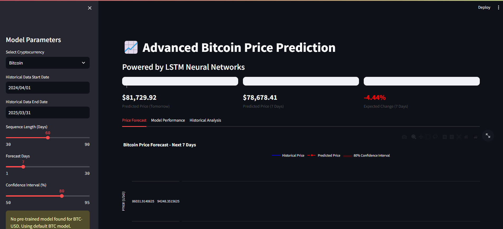
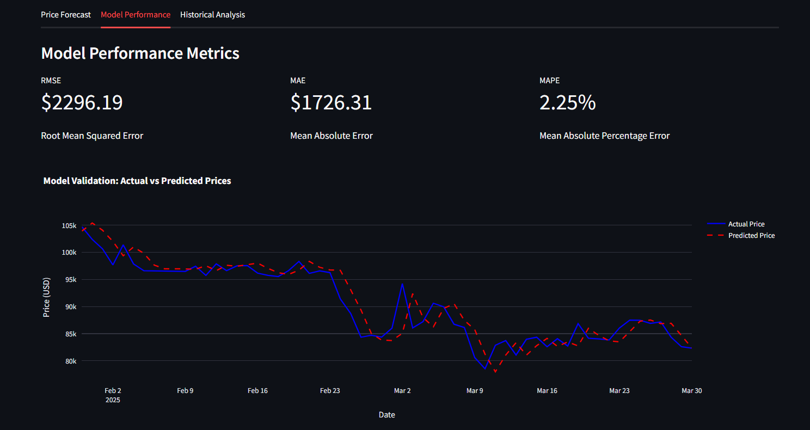
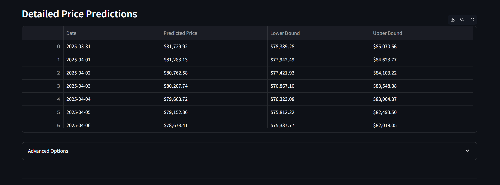

# Bitcoin-Price-Prediction

## 📌 Project Overview
This project utilizes a Long Short-Term Memory (LSTM) neural network to predict Bitcoin prices based on historical data. The model processes time-series data to forecast future prices, providing insights into cryptocurrency trends.

## 🚀 Features
- **Data Analysis & Preprocessing**: Load and preprocess historical Bitcoin price data.
- **LSTM Model**: Train an LSTM network to predict future Bitcoin prices.
- **Interactive Prediction**: Use the Streamlit app to input data and receive predictions.

## 📂 Project Structure
- **`cryptocurrency_data_analysis_and_prediction.ipynb`**: Jupyter Notebook containing data analysis, preprocessing, model training, and evaluation.
- **`app.py`**: Streamlit application for interactive Bitcoin price prediction.
- **`lstm_crypto_model.pth`**: Saved PyTorch model weights for the trained LSTM.

## 📊 Dataset
* The dataset consists of historical Bitcoin prices.
* Data includes attributes like date, open, high, low, close prices, and volume.
* Preprocessing includes normalization and converting data into a format suitable for LSTM.

## 🛠️ Technologies 
* **Programming Languages**: Python
* **Libraries** : PyTorch, NumPy, Pandas, Matplotlib, Scikit-learn, Streamlit
* **Deep Learning Framework** : LSTM Neural Network

## 🚀 How to Run the Project
1. *Clone the Repository*
   ```bash
     git clone https://github.com/Avinashrkrk/Bitcoin-Price-Prediction.git
2. *Navigate to the folder*
   ```bash
     cd Bitcoin-Price-Prediction
3. *Install Dependencies*
   ```bash
     pip install -r requirements.txt
4. *Running the Jupyter Notebook*: Open and execute `cryptocurrency_data_analysis_and_prediction.ipynb` to explore data analysis, model training, and evaluation steps.
5. *Running the Streamlit App*
   - Ensure `lstm_crypto_model.pth` is in the project directory.
   - Run the Streamlit application:
     ```bash
       streamlit run app.py
   - Access the app in your browser at `http://localhost:8501`
     
# Dashboard


# Model Performance Metrics


# Price Predictions 

  
## 📊 Results & Insights
* The LSTM model successfully learns Bitcoin price trends and predicts future values.
* Model performance can be further improved with additional features, hyperparameter tuning, and more historical data.
* The interactive Streamlit dashboard provides real-time visualization of predicted prices.

## 📌  Future Enhancements
* Integrate real-time Bitcoin price data for live predictions.
* Experiment with other deep learning architectures (e.g., GRU, Transformer models).
* Deploy as a web application with Flask or FastAPI.
